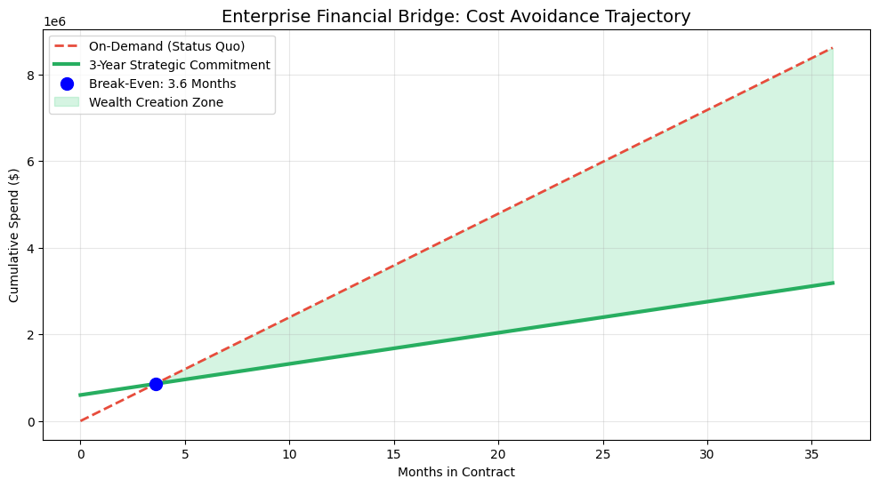

# 🏦 Strategic Contract Negotiation & $5.4M Cost Avoidance Framework

## 🎯 High-Level Objective
Developed a proprietary decision-support suite to facilitate multi-million dollar cloud vendor negotiations. This framework de-risks the transition from On-Demand OpEx to Strategic Capital Commitments for high-density AI/GPU infrastructure.

---

## 💎 Financial Impact (Key Results)
* **Validated Cost Avoidance:** $5,428,632.00 (36-Month Horizon)
* **Capital Recovery (Break-Even):** 3.6 Months
* **Strategic ROI:** 170.53%
* **Safety Margin:** Accretive profitability maintained down to 40% utilization levels.

---

## 📈 Executive Visualization: The Wealth Creation Bridge

*This visualization identifies the 'Crossing of the Rubicon'—the precise moment the company moves from a cost-center to a profit-generating infrastructure state.*

---

## 🛡️ Risk Management (Stress Test)
Unlike standard ROI calculators, this engine stress-tests the contract against real-world engineering volatility.

| Utilization Level | Net Financial Gain | Strategic Verdict |
| :--- | :--- | :--- |
| **100% (Baseline)** | **$5.42M** | ✅ High-Margin Advantage |
| **60% (Downside)** | **$1.98M** | ✅ Defensively Sound |
| **40% (Worst Case)** | **$0.26M** | ✅ Capital Positive |

---

## 🔒 Proprietary Methodology
The underlying **Commitment ROI Engine** (located in `/model`) uses a "Black Box" deterministic logic to model cash-flow drag and vendor arbitrage. Source code is restricted to protect the specific financial heuristics used for enterprise-level negotiations.
